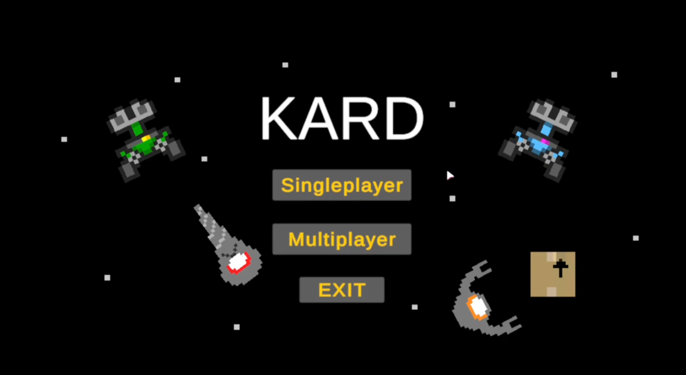

# KARD
Created by Jacob Beason Entwistle for 2D game programming. (CMP4264)

## Overview
**Kindly Automated Retrieval Droid**

This project is a 2D side scrolling game which was originally my 2D game programming project for year 1 semester 1 of university. 
KARD has now become a complete game full of features that I take pride in.

## Story
The game is about a small robot who was thrown from his ship and stranded in space, his one purpose is to retrieve as much lost cargo as he can.
He quickly finds out that he's not the only one who wants the cargo, he must evade enemies and grab the cargo before they do.

## Features
- 2D gameplay
- Multiplayer
- Enemies
- Custom Textures/Sprites
- Custom SFX
- Collectibles
- Boosts

## Controls
- WSAD to move

## Credits
Consolas Font © 2005 Microsoft Corporation. All Rights Reserved.

All other assets (sprites, textures, sounds, scripts) were made by me.
